# 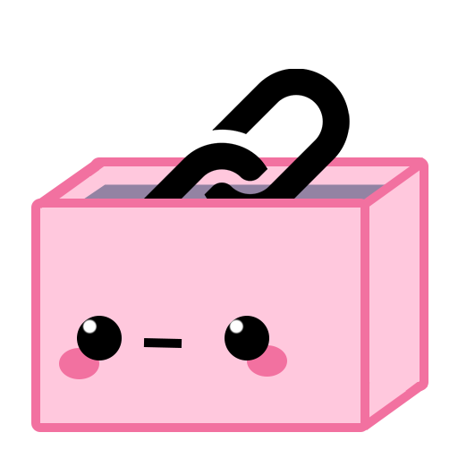 Linksaver 
Linksaver is an Android application created for saving web links. It's available in Spanish and English. 

<kbd>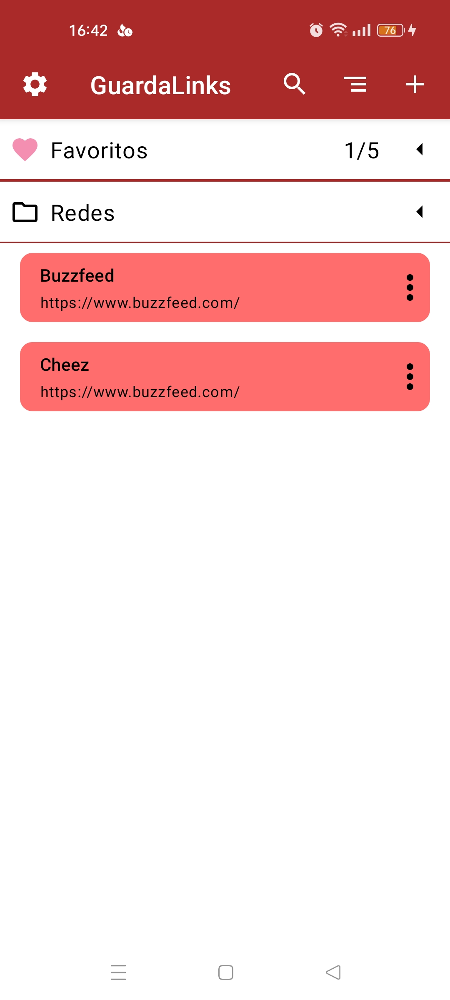</kbd> <kbd>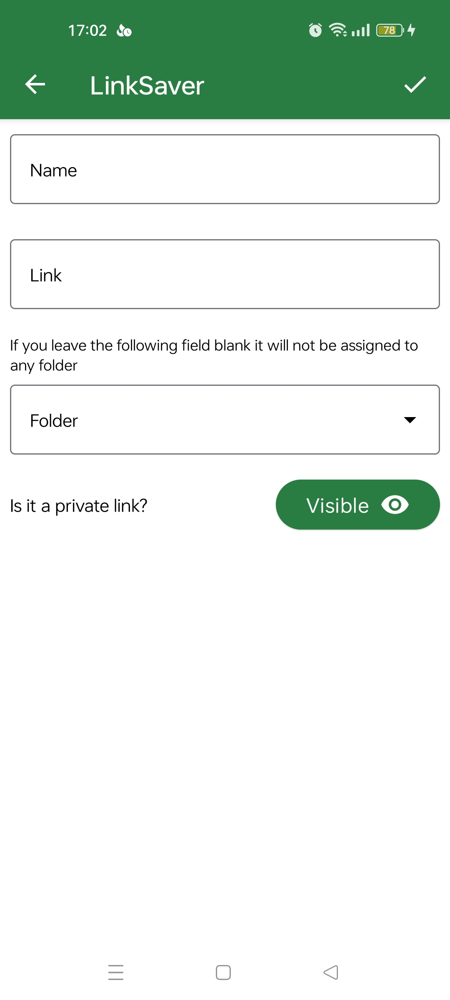</kbd>

## Main Menu
In the main menu, you can see all the saved links, your folders, including favorites' folders, and the different features available in the top bar. You can press the icons in the top bar to go to configuration, search for a link, sort your links and add new ones.

<kbd>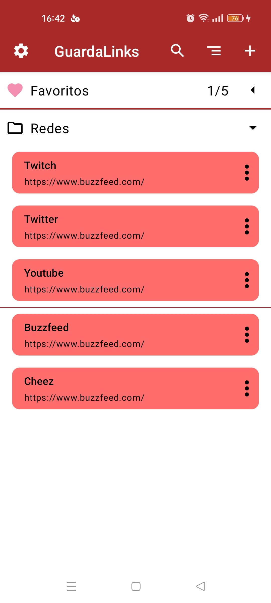</kbd>

If you press a link button, your phone will open your navigator and go to the saved link. If you long-press or hold, the link will be copied to your clipboard. You can also press the three little dots on the card to unfold a little bar in which there are options to configure your link. You can add it to a folder, add it to favorites, share it, edit it or delete it.

<kbd>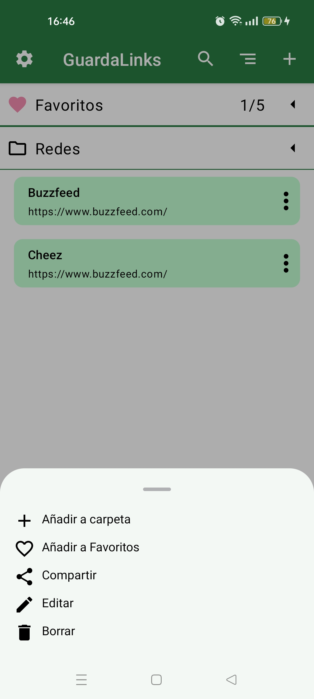</kbd> <kbd>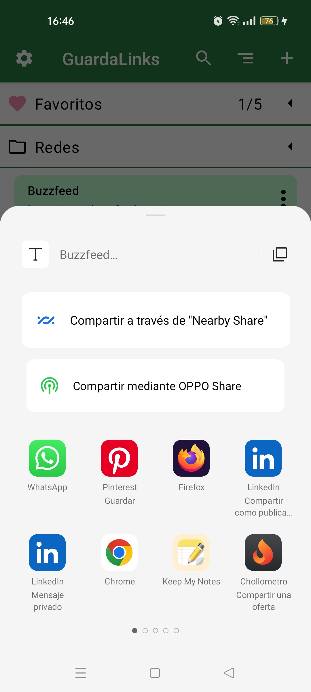</kbd>

## Add link
If you press the icon "+" in the main menu, you'll be navigating to a new screen, on which you can add a new link. You have to insert the name and the web link, if you don't give a name, the link will take the web link as a name. You can also select a folder to save it and mark the link as private so you can only see it if you put your phone password (or your preferred unblocking method).
If you try to go back without saving the link, an alert dialog will appear, warning you.

<kbd></kbd>

## Sort Links
If you press the sort icon on the main screen, you'll be navigating to a new screen, on which you can choose how the links are sorted on the main screen. You can choose between the options shown in the picture, and the option chosen will be persistent between sessions.

<kbd>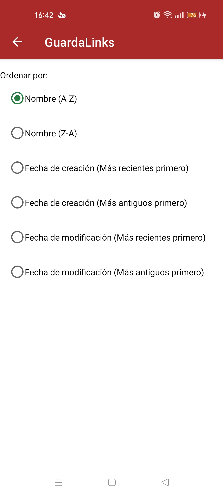</kbd>

## Search Link
If you press the search icon on the main screen, the top bar will change. A text edit will appear. There, you can write the name or web link you are searching for, and it will appear below.

<kbd>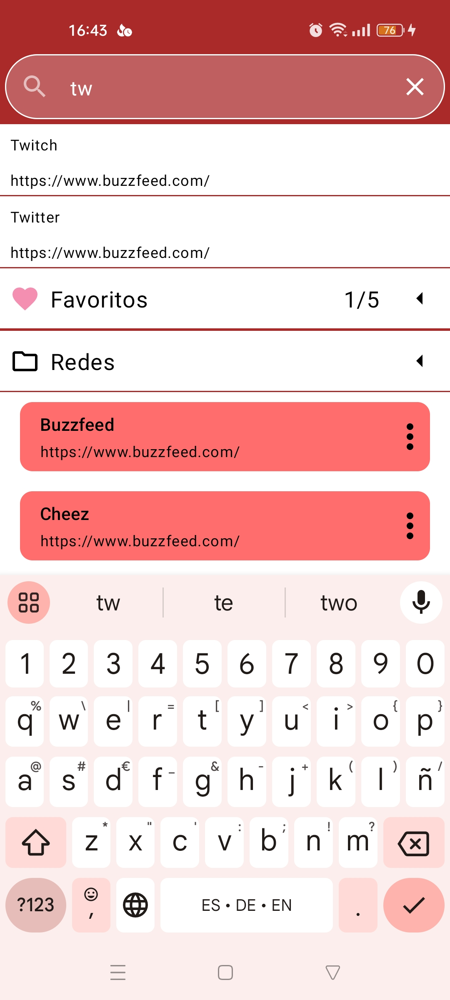</kbd>

## App Configuration
If you press the configuration icon on the main screen, you'll be navigating to a new screen, on which you can change different aspects of the app.

<kbd>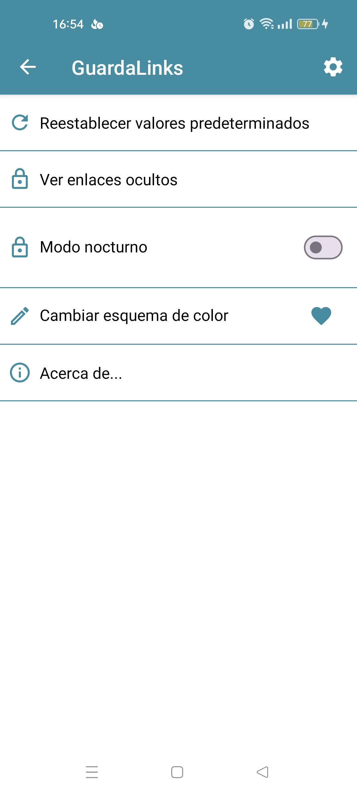</kbd>

You can see hidden links by inserting your preferred method of unblocking the phone. You can also change the color scheme or change between dark mode and light mode.

<kbd>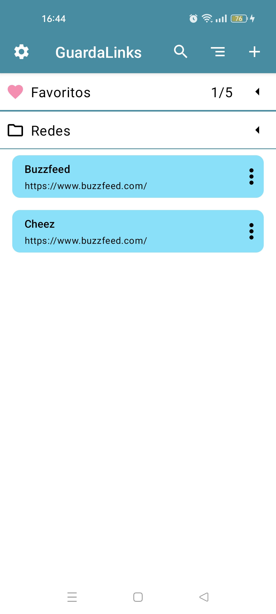</kbd> <kbd>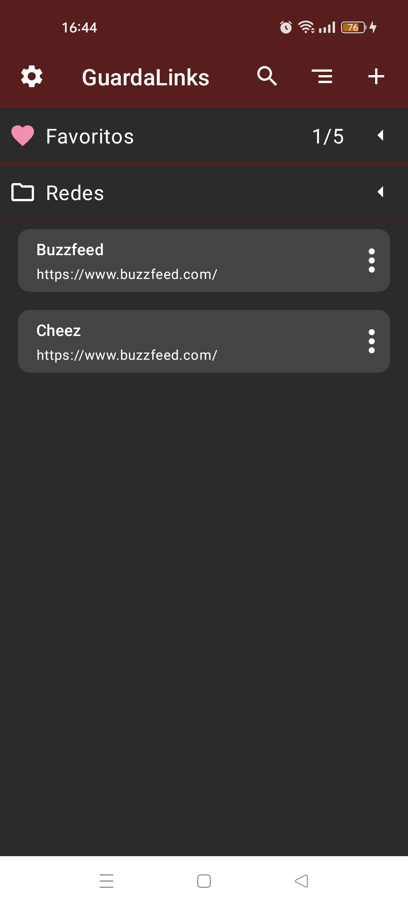</kbd>
